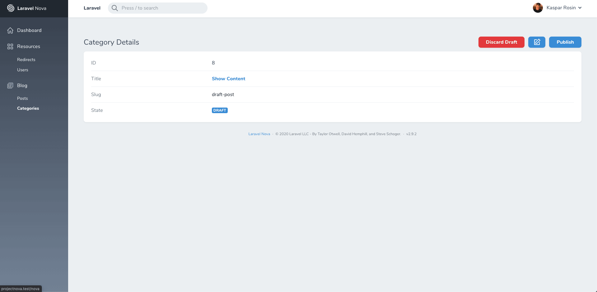
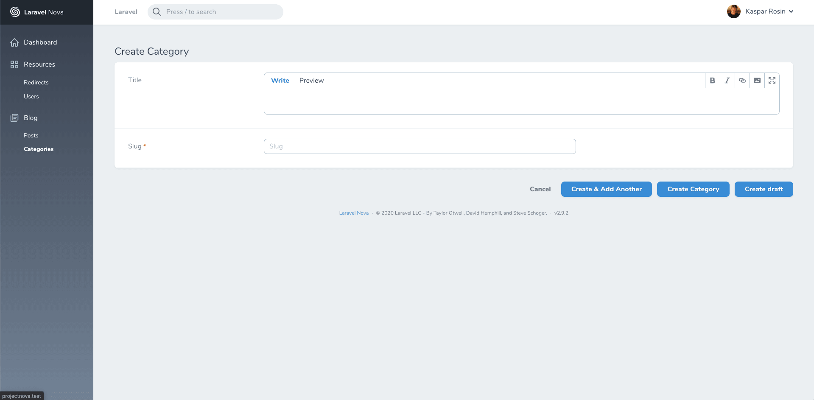
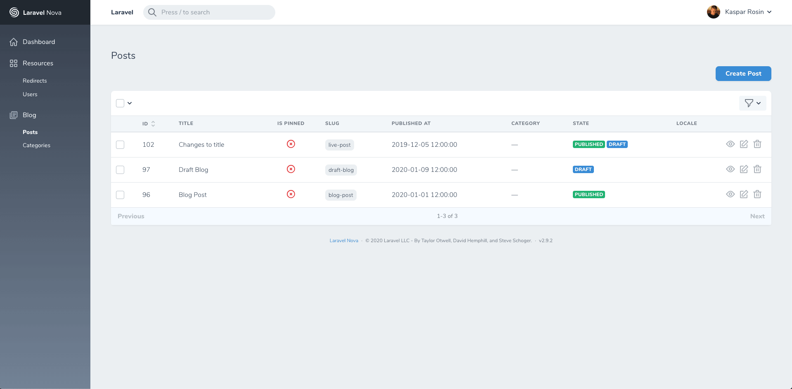

# Nova Drafts

[](https://packagist.org/packages/optimistdigital/nova-drafts)
[](https://packagist.org/packages/optimistdigital/nova-drafts)

This [Laravel Nova](https://nova.laravel.com) field allows you to make drafts of your resources.

## Features

- **Create Drafts**
- **Artisan Command to create Migration**

## Screenshots







## Installation

Install the package in a Laravel Nova project via Composer:

```bash
composer require optimistdigital/nova-drafts
```

## Usage

### Preparing the models and database

This field requires a few database changes - namely, the model requires three new columns
**Migrations can be created using the following Artisan command:**

```bash
php artisan drafts:migration {table?}
```

if table name is not provided, a choice of all available tables is provided.

**If your table has pre-existing Unique constraint:**
It's recommended to add 'published' field to the unique constraint.
More information inside the migration file.

### Creating the field

```php
use OptimistDigital\NovaDrafts;

UnpublishButton::make('Unpublish'),
DraftButton::make('Draft'),
PublishedField::make('State', 'published'),
```

### Index Filtering (IndexQuery)

Inside your **Model** add the following snippet:

```php
public function childDraft()
{
    return $this->hasOne(YourModelName::class, 'draft_parent_id', 'id');
}
```

Inside your **Index Query** use that function, to filter out published pages that have drafts:

```php
public static function indexQuery(NovaRequest $request, $query)
{
    return $query->doesntHave('childDraft');
}
```

## Options

Possible option you can pass to the field using the option name as a function

| Option          | Type    | Default | Description                               |
| :-------------- | :------ | :------ | :---------------------------------------- |
| `draftsEnabled` | boolean | true    | boolean whether drafts are enabled or not |

## Localization and text customization

The translation file(s) can be published by using the following publish command:

```bash
php artisan vendor:publish --provider="OptimistDigital\NovaDrafts\FieldServiceProvider" --tag="translations"
```

You can add your translations to `resources/lang/vendor/nova-drafts/` by creating a new translations file with the locale name (ie `et.json`) and copying the JSON from the existing `en.json`.

To get a single setting's value, call `nova_get_setting('some_setting_key')`. It will return either a value or null if there's no setting with such key.

# Credits

- [Kaspar Rosin](https://github.com/kasparrosin)
- [Mikk Õun](https://github.com/mikkoun)
- [Tarvo Reinpalu](https://github.com/tarpsvo)

# License

Nova Drafts is open-sourced software licensed under the [MIT license](https://github.com/optimistdigital/nova-drafts/blob/master/LICENSE.md)
